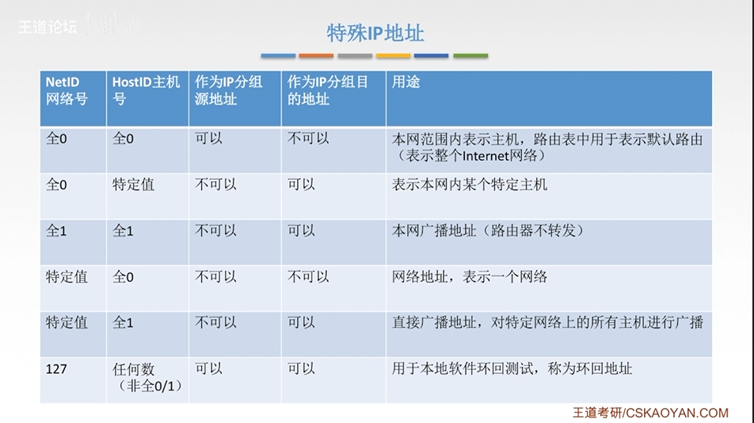
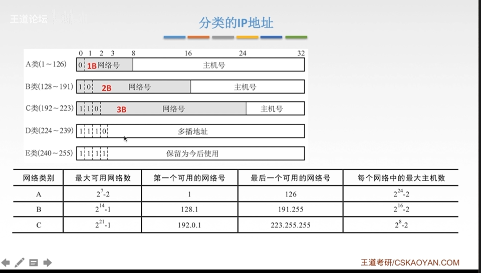

# IPv4地址

## IP编制的历史阶段

- 分类的IP地址
- 子网的划分
- 构成超网(无分类编制方法)

## 分类的IP地址

- IP地址: 全世界唯一的32位/4字节标识符,标识路由器主机的接口
- IP地址::= {<网络号><主机号>}

### 私有IP地址

| 地址类别 |           地址范围            | 网段个数 |
| :------: | :---------------------------: | :------: |
|   A类    |  10.0.0.0~10.255.255.255.255  |    1     |
|   B类    | 172.16.0.0~172.31.255.255.255 |    16    |
|   C类    |  192.168.0.0~192.168.255.255  |   256    |
