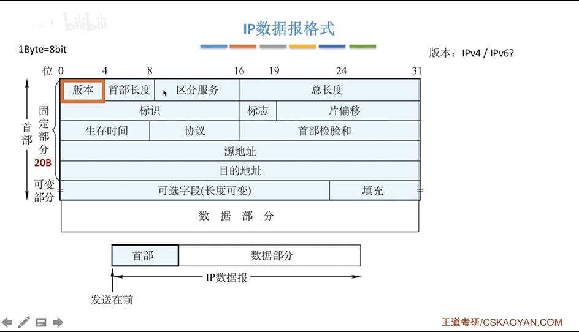

# IP数据报分片

## 最大传输单元MTU

- 链路层数据帧可封装数据的上限
- 以太网的MTU是1500字节
- 如果所传输的数据报长度超过某链路的MTU值? 分片

- 标识:同一数据报的分片使用同一标识
- 标志: 只有2位有意义, x__
  - 中间为DF(Don't Fragment)
    - DF=1 禁止分片
    - DF=0 允许分片
  - 最低位MF(More Fragment)
    - MF=1, 后面还有而分片
    - MF=0, 代表最后一片/没分片
- 片偏移: 指出较长分组分片后,某片在源分组中的相对位置,以8B为单位 -> 除了最后一个分片,每个分片的长度一定是8B的整数倍

- 总长度单位是1B
- 片偏移单位是8B
- 首部长度单位是4B
