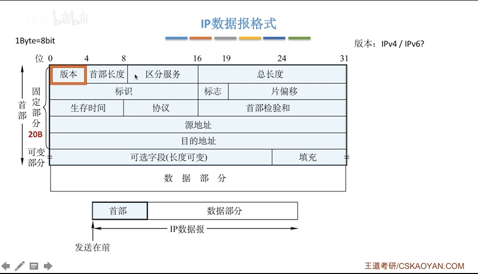

# IP数据报格式

- 首部(发送在前)
  - 固定部分
  - 可变部分
- 数据部分(TCP, UDP段)

- 版本: IPv4/IPv6
- 首部长度: 单位是4B,最小为5
- 区分服务: 指示期望获得那种类型的服务
- 总长度: 首部+数据,单位是1B
- 生存时间(TTL): IP分组的保质期,经过一个路由器-1,变成0则丢弃
- 协议: 数据部分的协议
- 首部校验和: 只检验首部
- 源IP地址和目的地址: 32位
- 可选字段: 0-40B,用来支持排错,测量以及安全等措施
- 填充: 全0, 把首部补成4B的整数倍
