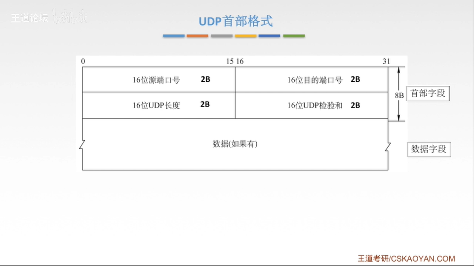
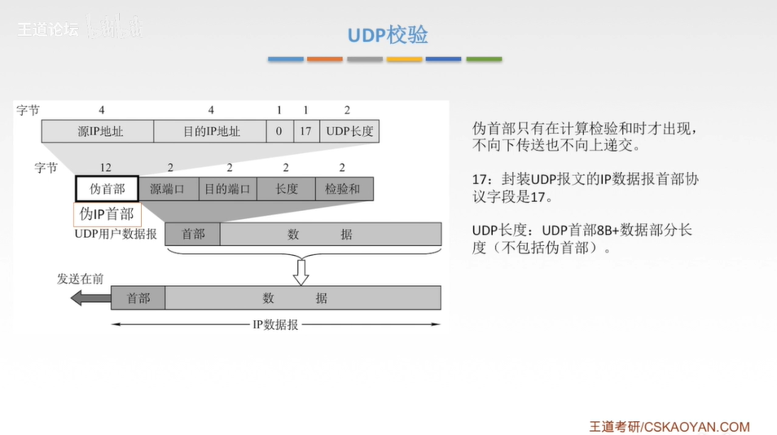

# UDP协议

## 用户数据报协议UDP概述

- UDP只在IP数据报服务之上增加了很少功能,即复用分用和差错检测功能
- UDP是无连接的,减少开销和发送数据之间的时延
- UDP使用最大努力交付,即不保证可靠交付
- UDP是面向报文的,适合一次性传输少量数据的网络应用
- 应用层给UDP多长的报文,UDP就照样发送,即一次发一个完整报文
- UDP无拥塞控制,适合很多实时应用
- UDP首部开销小,8B, TCP是20B

## UDP首部格式

分用时,找不到对应的目的端口号,就丢弃报文,并给发送方发送ICMP端口不可达报文,差错报告报文

## UDP检验和

- 伪首部只有在计算校验和时才出现, 不向下传送也不向上递交
- 17: 封装UDP报文的IP数据报首部协议字段是17
- UDP长度: UDP首部8B+数据部分长度(不包括伪首部)

在发送端

- 填上伪首部
- 全0填充检验和字段
- 全0填充数据部分(UDP数据报要堪称许多4B的字串接起来)
- 伪首部+首部+数据部分采用二进制反码求和
- 把和求反码填入检验和字段
- 去掉伪首部,发送

在接收端

- 填上伪首部
- 伪首部+首部+数据部分采用二进制反码求和
- 结果全为1则无差错,否则丢弃数据报/交给应用层附上出差错的警告
